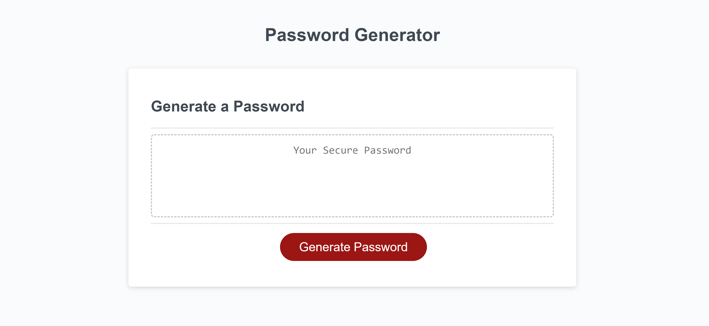

# challenge3-password-generator

For this challenge I will be creating a code in javascript that will create a password when the user clicks "generate password" and the password provided will follow a certain set of requirements as well as ask the user how long they would prefer their password to be.

- What was your motivation?
My motivation is to master javascript as it is a little difficult for me
- Why did you build this project? 
To showcase what i've learned and recieve feedback on my code
- What problem does it solve?
This website helps me understand Javascript if loops
- What did you learn?
I learned to create an if loop with Java to create a password generator

---

## Installation
<ol>
    <li>Create Repository on Github</li>
    <li>Clone Repository to Computer and open in VS Code</li>
    <li>Create file structure</li>
    <li>Create code in JS that will provide user with a password</li>
    <li>Create README.md file</li>
    <li>Deploy link and submit in bootcamp</li>
</ol>

---

## Usage

Link to website: https://bizwliz.github.io/challenge3-password-generator/

---

## Credits

I truly benefited from working alongside my piers:
<ul>
    <li>Annie Sosa</li>
    <li>Jovanni Bogardus</li>
    <li>Rujaine Mena</li>
    <li>Mia Olmedillo</li>
    <li>Lourdes Dorvilus</li>
</ul>

---

## License

 

---

## Tests

Tested using VS Code.
